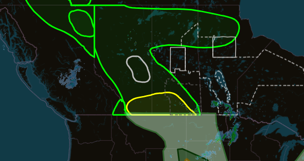
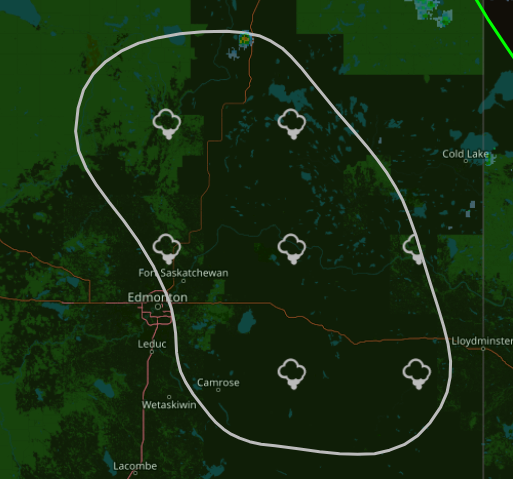
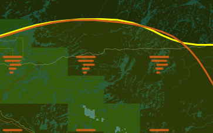
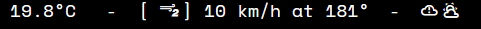

# Current State of Envirotron Web
Most Major features functional (Alerts, mostly functional outlooks, data storage)

<!-- more -->

## Recent Features
- All ECCC Icon Codes now work

### Additional Data on outlooks

/// caption
Thunderstorm Outlook funnel cloud region
///

/// caption
Thunderstorm Outlook High Tornado Risk Region
///

## Current Bugs/Missing features
- ECCC Outlooks not auto loading (onto server)
- Components dont auto restart
- Extra symbols show up
    - 
- Timezones?

## Untested
- Extreme Risk ECCC TSO

...