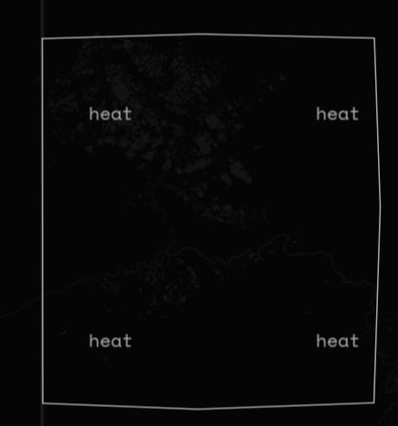
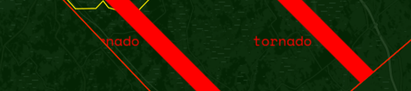
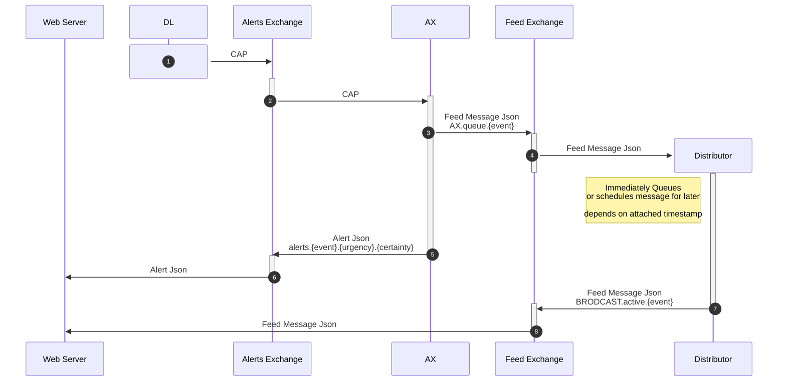
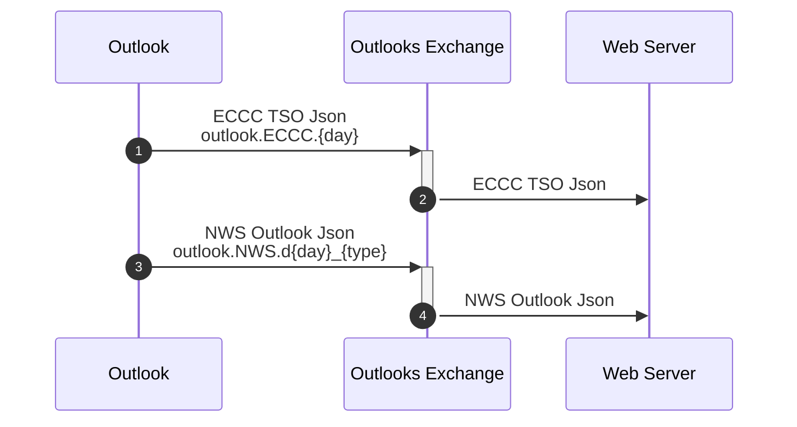

# Current State of Envirotron Web
Most Major features functional (Alerts, mostly functional outlooks, data storage)

<!-- more -->

## Recent Features
- All ECCC Icon Codes now work

### Additional Data on outlooks

/// caption
Thunderstorm Outlook funnel cloud region
///

/// caption
Thunderstorm Outlook High Tornado Risk Region
///

### Aditional styling on some alerts
some Alerts have a caption that displays on them

/// caption
Heat Warning
///

#### Warnings
some severe warnings(currently Tornados and waterspouts) have additional stripes on them

/// caption
Tornado Warning - has stripes and text
///

#### Watches and Advisories
Watches and Advisories have a dashed outline instead of a solid outline.

/// caption
Special Air Quality Statement
///

## Current Bugs/Missing features
- ECCC Outlooks not auto loading (onto server)
- NWS Outlooks past Day1
- Components dont auto restart
- Extra symbols show up
    - 
- Timezones?
- local alerts getting frozen until webserver reboot

## Untested
- Extreme Risk ECCC TSO

## Project Layout
### Alerts

### Outlooks
