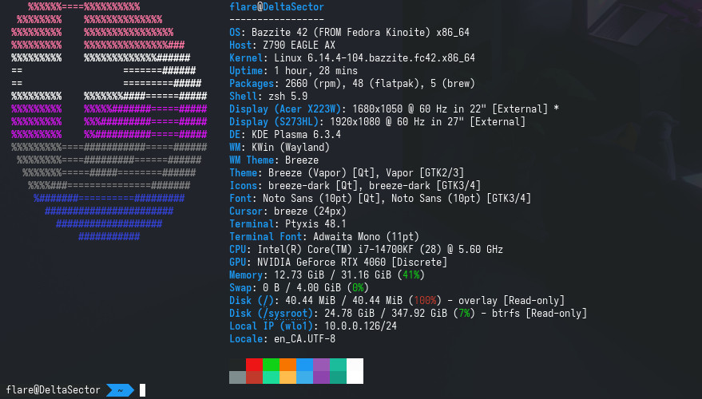

# Moving To Linux - Deciding a distro
I am DONE with microsoft's BS with windows
<!-- more -->
## Possible OSes
| OS | Score |
|:--:| ----:|
| Arch | -2 |
| Ubuntu | 0 |
| SteamOS | N/A |
| Bazzite | 5 |

=== "Arch"
    { width=25}

    Pros

    - Experience
        - I have used arch in the past(using AlphaSector as a server)
    - customizability

    Cons

    - difficulty
    - Arch
    - not made for gaming
    - Audio

=== "Ubuntu"
    { width=25}

    Pros

    - Simple
    - Support

    Cons

    - Dont like the WM(GNOME)
    - not made for gaming

=== "SteamOS"
    { width=100 }

    ***Not currently available for my hardware***

    Pros

    - Simple
    - Support
    - made for gaming
    - comes with Proton support(windows emulation)
    
    Cons

    - Intended for handhelds
    - Not currently available for hardware
        - Would need to wait
    - Update frequency
    - not intended for developers

=== "Bazzite"
    { width=25}

    !!! warning
        Hostile devs and poor performance

    Pros

    - Simple
    - made for gaming
    - comes with Proton support(windows emulation)
    - SteamOS like
    - Update frequency
    - WM Options

    Cons

    - not intended for developers

## Testing In VM - Bazzite

!!! Note
    - hyfetch nightly needed
        - `pip install git+https://github.com/hykilpikonna/hyfetch.git@master`