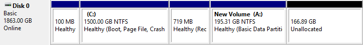
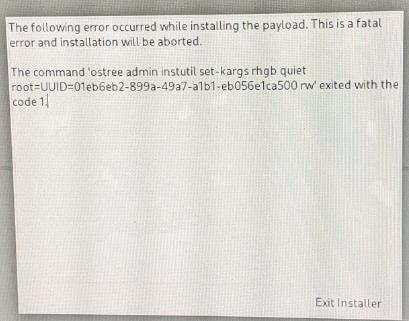
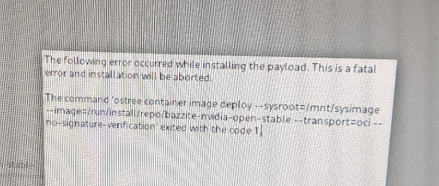
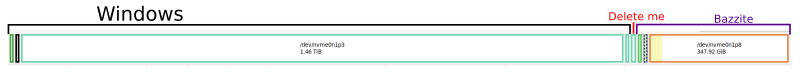

# Moving To Linux - Phase 1
Distro: Bazzite { width=25}

Phase 1: Install and setup
<!-- more -->
!!! info "Hardware in need of software"
    - G502 Mouse - RGB, sensitivity
    - Stream deck mini

I left 166.89GB at end of disk when I installed Windows on my pc, planning for this


## Setup Problems
### Partitioning

/// caption
`'ostree admin instutil set-kargs rhgb quiet root=UUID=... rw' exited with the code 1`

[Reddit Thread on this](https://www.reddit.com/r/Bazzite/comments/1f5hxhy/please_help_installation_issue_with_boot_loader/)
///


/// caption
`'ostree container image deploy --sysroot=... --image=... --transport=oci --no-signature-verification' exited with the code 1`

If I reboot and try again

[someone's Github issue](https://github.com/ublue-os/bazzite/issues/1016)
///

what I did wrong: incorrect partitioning

my setup:
```
mount point: /boot/efi
    format:      EFI system partition
    size:        100MB

mount point:
    format: btrfs
    size: [max]

mount point: /
    format:      btrfs (subvolume)
```
!!! info "Correct Partitioning"
    ```
    mount point: /boot/efi
        format:      EFI system partition
        size:        300MB

    mount point: /boot
        format:      ext4
        size:        1GB

    mount point:
        format: btrfs
        size: [max]

    mount point: /
        format:      btrfs (subvolume)

    mount point: /var
        format:      btrfs (subvolume)

    mount point: /var/home
        format:      btrfs (subvolume)
    ```
## Post Install


|   Device   | Software |
| ---------- | -------- |
| G502 Mouse | piper    |
| Stream deck| OpenDeck |

VSCode user settings
```json 
{
  "terminal.integrated.defaultProfile.linux": "bash",
  "terminal.integrated.profiles.linux": {
    "bash": {
      "path": "host-spawn",
      "args": ["/var/home/linuxbrew/.linuxbrew/bin/zsh"]
    }
  }
}
```



### Notes
- LAYER VSCode dont use flathub

## Next Steps
- [ ] move files and accounts
- [ ] setup VR
- [ ] move partitions around
    - this might require a reinstall

## Concluding Notes
- So far I have enjoyed bazzite
    - easy to install when you follow the guide
- ***DO NOT FOLLOW THE PARTITIONING GUIDE FOR ARCH ON BAZZITE***
- I need to clean up my files in windows