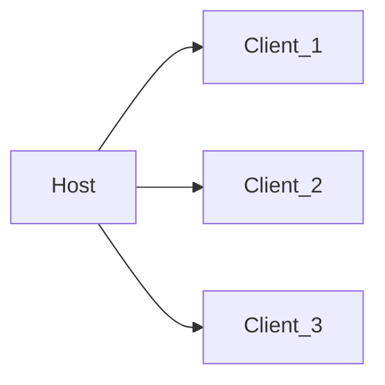
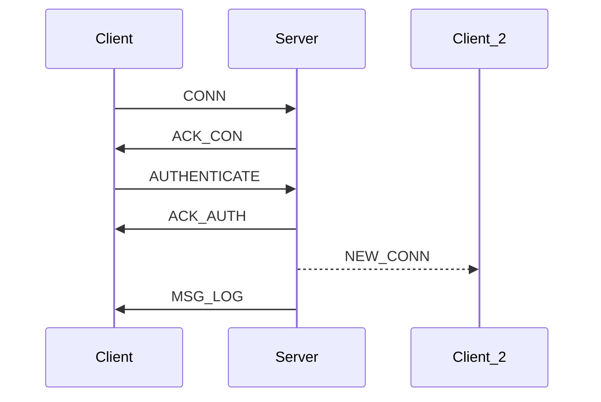
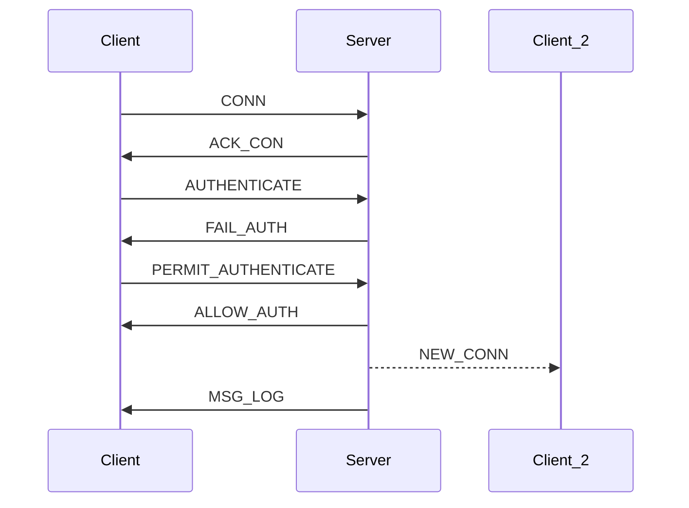
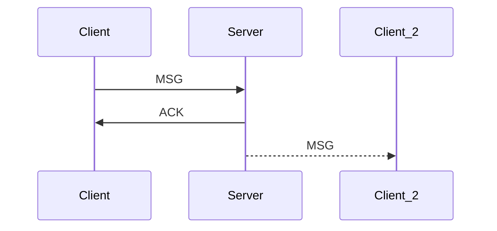
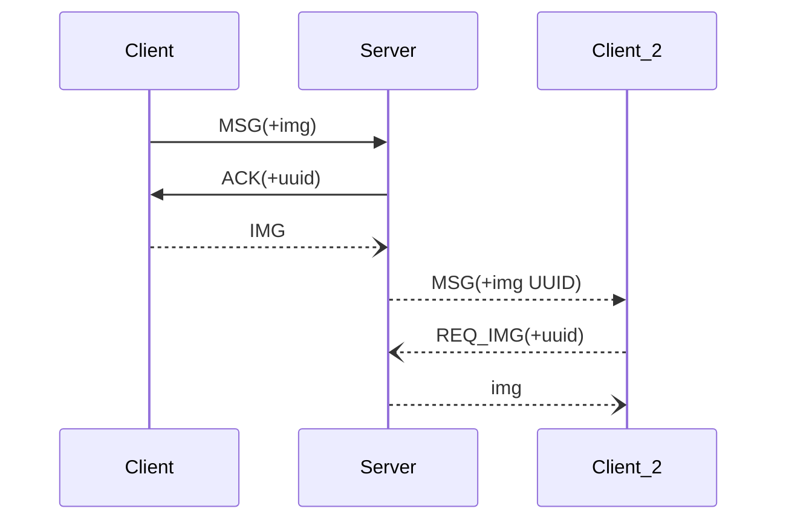
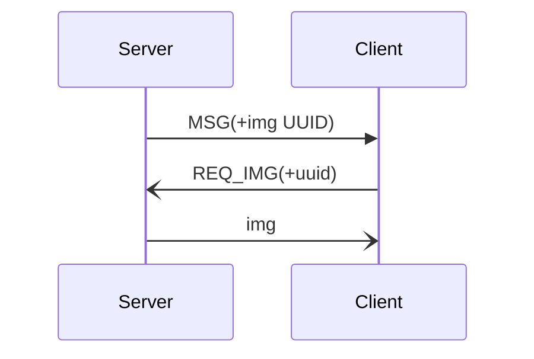
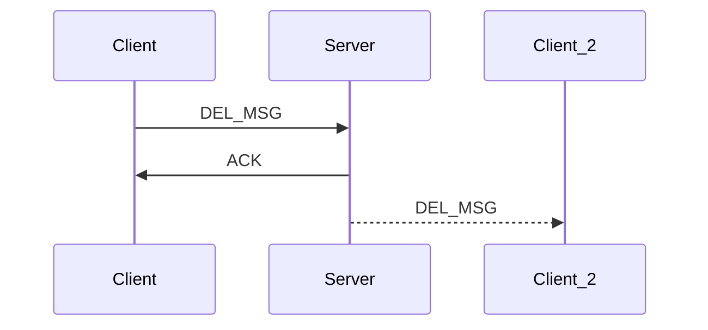

# Critter Net

```mermaid
flowchart LR
Host-->Client_1
Host-->Client_2
Host-->Client_3
```
## Protocol

### Real Time
#### Connection

```mermaid
sequenceDiagram
    Client->>Server: CONN
    Server->>Client: ACK_CON
    Client->>Server: AUTHENTICATE
    Server->>Client: ACK_AUTH
    Server-->>Client_2: NEW_CONN
    Server->>Client: MSG_LOG
```
##### unauthenticated

```mermaid
sequenceDiagram
    Client->>Server: CONN
    Server->>Client: ACK_CON
    Client->>Server: AUTHENTICATE
    Server->>Client: FAIL_AUTH
    Client->>Server: PERMIT_AUTHENTICATE
    Server->>Client: ALLOW_AUTH
    Server-->>Client_2: NEW_CONN
    Server->>Client: MSG_LOG
```
#### Message

```mermaid
sequenceDiagram
    Client->>Server: MSG
    Server->>Client: ACK
    Server-->>Client_2: MSG
```

##### Image

```mermaid
sequenceDiagram
    Client->>Server: MSG(+img)
    Server->>Client: ACK(+uuid)
    Client--)Server: IMG
    Server-->>Client_2: MSG(+img UUID)
    Client_2--)Server: REQ_IMG(+uuid)
    Server--)Client_2: img
```
###### RECV

```mermaid
sequenceDiagram
    Server->>Client: MSG(+img UUID)
    Client-)Server: REQ_IMG(+uuid)
    Server-)Client: img
```
##### DELETE

```mermaid
sequenceDiagram
    Client->>Server: DEL_MSG
    Server->>Client: ACK
    Server-->>Client_2: DEL_MSG
```