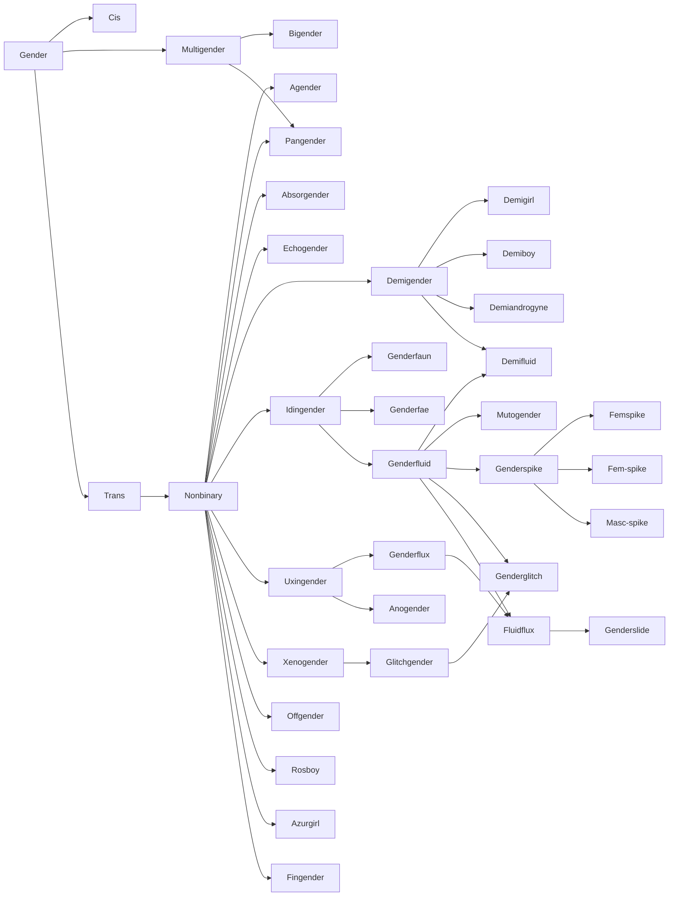

# Genders
Graph of as many genders as I could find
<!-- more -->

```mermaid
flowchart LR
    Gender

    Cis
    Gender-->Cis

    Multigender 
    Gender-->Multigender 
    Bigender
    Multigender-->Bigender

    Trans
    Gender-->Trans

    Nonbinary
    Trans-->Nonbinary

    Agender
    Nonbinary-->Agender

    Pangender
    Nonbinary-->Pangender
    Multigender-->Pangender

    Absorgender
    Nonbinary-->Absorgender

    Echogender
    Nonbinary-->Echogender

    Demigender
    Nonbinary-->Demigender
    Demigirl
    Demiboy
    Demiandrogyne
    Demigender-->Demigirl
    Demigender-->Demiboy
    Demigender-->Demiandrogyne

    Idingender
    Nonbinary-->Idingender
    Genderfaun
    Idingender-->Genderfaun
    Genderfae
    Idingender-->Genderfae
    Genderfluid
    Idingender-->Genderfluid
    Demifluid
    Genderfluid-->Demifluid
    Demigender-->Demifluid
    Mutogender
    Genderfluid-->Mutogender
    Genderspike
    Genderfluid-->Genderspike
    
    

    Femspike
    Genderspike-->Femspike
    Fem-spike
    Genderspike-->Fem-spike
    Masc-spike
    Genderspike-->Masc-spike

    Genderglitch
    Genderfluid-->Genderglitch

    Uxingender
    Nonbinary-->Uxingender
    Genderflux
    Uxingender-->Genderflux
    Anogender
    Uxingender-->Anogender

    Fluidflux
    Genderslide
    Genderfluid-->Fluidflux 
    Genderflux-->Fluidflux 
    Fluidflux-->Genderslide 

    Xenogender
    Nonbinary-->Xenogender

    Glitchgender
    Xenogender-->Glitchgender
    Glitchgender-->Genderglitch

    Offgender 
    Nonbinary-->Offgender

    Rosboy
    Nonbinary-->Rosboy
    Azurgirl
    Nonbinary-->Azurgirl

    Fingender
    Nonbinary-->Fingender

```
## Resources
- [https://gender.fandom.com](https://gender.fandom.com)
- [https://lgbtqia.wiki/wiki](https://lgbtqia.wiki/wiki)