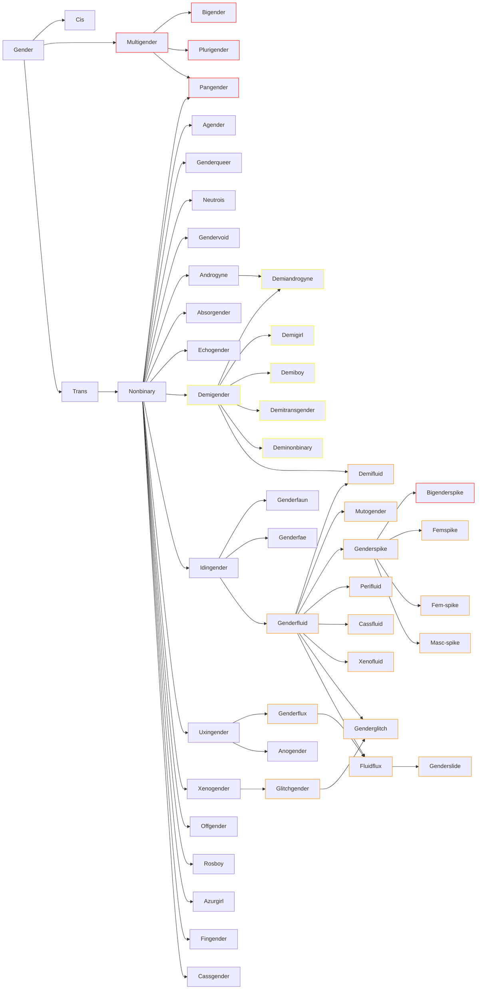

# Genders
Graph of as many genders as I could find
<!-- more -->
!!! warning
    Not all connections are shown, to make this actualy readable

## Resources
- [https://gender.fandom.com](https://gender.fandom.com)
- [https://lgbtqia.wiki/wiki](https://lgbtqia.wiki/wiki)